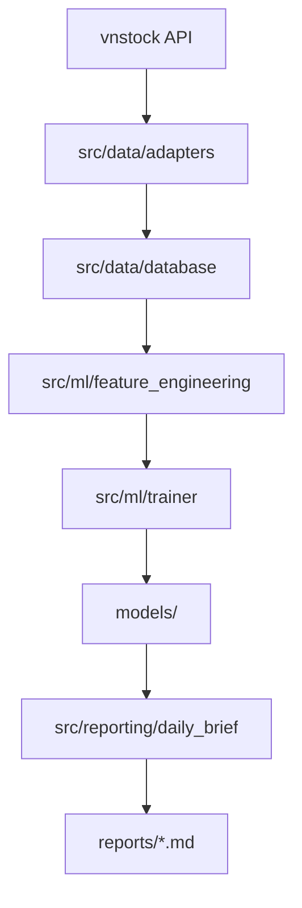

# Audit Report (Post-Restructuring)

The `AI-ML-LLM in Stock` repository has been audited and restructured for production-grade maintenance and scalability.

## Current Architecture

The codebase is organized into five primary logical domains, each with a clear responsibility:

*   **`src/data/`**: Standardized data ingestion, normalization, and universe management.
*   **`src/ml/`**: Machine Learning pipeline, including feature and label engineering, trainers, model storage, and experiments.
*   **`src/engine/`**: Core algorithmic processing, portfolio management, risk evaluation, and multi-agent orchestration.
*   **`src/reporting/`**: Actionable insight generation (daily briefs, ranked predictions, and performance metrics).
*   **`src/api/`**: Interaction layer, including web-based UI components and real-time streaming interfaces.

## Completed Features

*   **Ingestion**: Robust synchronization mechanism for VN100 OHLCV data via `sync_all_data.py`.
*   **ML Pipeline**: Modular training flow with support for classification, regression, and volatility targets.
*   **Feature Engineering**: Standardized technical and fundamental feature generation with time-safe transforms.
*   **Experiment Tracking**: Centralized logging of training outcomes and model metadata.
*   **Data Quality**: Validation layer for ingestion and training datasets.
*   **Reporting**: Automated generation of ranked stock prediction tables and daily briefs.

## Incomplete Components / Technical Debt

*   **Unified Entry Point**: The project still relies on multiple independent scripts in `scripts/`. A unified CLI wrapper (e.g., `main.py`) would improve usability.
*   **Path Standardization**: While `settings.py` centralizes some parameters, many scripts still use string-based paths that should be fully converted to `pathlib` objects.
*   **Internal Redundancy**: Some logic in `src/ml/labels/` and `src/ml/features/` might overlap with legacy code in `archive/`.

## Data Flow

## Risks and Mitigation

*   **Import Depth**: Nested packages (e.g., `src.ml.accuracy`) may require multi-level relative imports. This has been addressed by updating all `src.` prefixes to match the new depth.
*   **Legacy Scratch**: Scratch scripts were moved to `archive/` rather than deleted, ensuring that any one-off logic is preserved but isolated from the production path.
