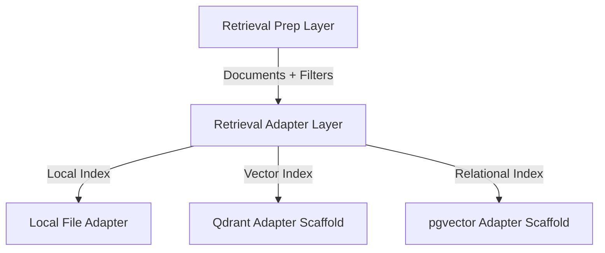

# Retrieval Adapter Layer

The **Retrieval Adapter Layer** provides a backend-agnostic abstraction for document ingestion and retrieval. It allows the Quant Core platform to plug into various search backends (Local Store, Qdrant, pgvector) without modifying the core research logic.

## Positioning



## Core Abstractions

- **RetrievalAdapter**: Abstract base class defining the contract (`ingest`, `query`, `fetch_by_id`).
- **RetrievalFilters**: Canonical filter model for hybrid search (Ticker, Regime, etc.).
- **RetrievalQueryResult**: Standard output format for search results, maintaining provenance links.

## Reference Implementation: Local File Adapter

For local development and testing, we provide a `FileRetrievalAdapter`.
- **Persistence**: Flat JSONL store in `artifacts/retrieval_ingest/`.
- **Search**: lexical substring matching and exact metadata filtering.
- **Verification**: Used as the primary validation backend for this phase.

## Usage

### Ingestion
```bash
python scripts/run_retrieval_ingest.py \
  --mode build_from_existing_retrieval_prep \
  --backend file \
  --retrieval-prep-dir artifacts/retrieval_prep
```

### Querying
```bash
python scripts/run_retrieval_query.py \
  --backend file \
  --query "bull regime" \
  --filter "ticker:ACB"
```

## Implementation Links
- **Contract**: [src/retrieval/base.py](../src/retrieval/base.py)
- **Local Adapter**: [src/retrieval/file_adapter.py](../src/retrieval/file_adapter.py)
- **Ingest Runner**: [scripts/run_retrieval_ingest.py](../scripts/run_retrieval_ingest.py)
