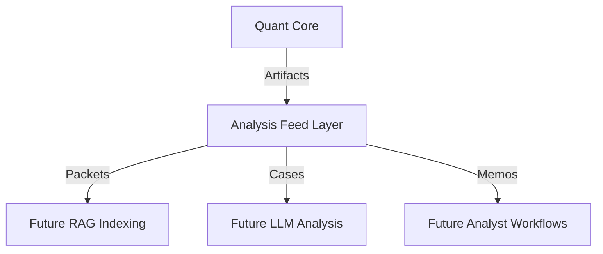

# Analysis Feed Layer
## Document Metadata

| Field | Value |
| --- | --- |
| Document type | Architecture note |
| Created / authored | Tuesday, 2026-04-28 22:34:05 ICT (UTC+07:00) |
| Last updated | Tuesday, 2026-04-28 22:34:05 ICT (UTC+07:00) |
| Timezone | Asia/Ho_Chi_Minh / ICT (UTC+07:00) |
| Branch | `vsef-doc-datetime-metadata-standardization` |
| Commit | `8800ce6e3780c7978856737e70cb5e3b999eacee` |
| Timestamp source | current metadata standardization run |
| Status | Active |

The **Analysis Feed Layer** is a structured data normalization bridge between the **Quant Core** and downstream **RAG**, **LLM**, and **Human Analyst** workflows.

## Positioning



## Core Principles

1.  **Derived-Only**: The feed layer strictly transforms existing validated quant-core artifacts. It never recomputes forecasting, risk, or regime logic.
2.  **Manifest-First**: Provenance is tracked from the `run_manifest.json` down to individual packets.
3.  **Stable IDs**: Entities use deterministic IDs (e.g., `pkt_{core_run_id}_{ticker}_{date}_{horizon}...`) to ensure idempotency and cross-link stability.
4.  **Retrieval-Ready**: Outputs include pre-computed summaries and flat metadata for efficient filtering and vector search.

## Key Components

- **Forecast Research Packets**: The canonical record for every ticker/window scenario.
- **Historical Case Records**: Retrieval-ready objects with deterministic, structured summaries.
- **Analyst Memo Drafts**: Evidence-based placeholders for human/LLM review.
- **Retrieval Metadata**: Flat schema for indexed filtering.

## Implementation Details

- **Schema**: [ANALYSIS_FEED_SCHEMA.md](ANALYSIS_FEED_SCHEMA.md)
- **Normalization Logic**: [src/reporting/analysis_feed.py](../../src/reporting/analysis_feed.py)
- **Runner**: [scripts/run_analysis_feed.py](../../scripts/run_analysis_feed.py)

## Workflow

1.  Run the Quant Core to produce a validated artifact directory.
2.  Execute the Analysis Feed runner:
    ```bash
    python scripts/run_analysis_feed.py \
      --mode build_from_existing_quant_core \
      --quant-core-dir artifacts/quant_core \
      --output-dir artifacts/analysis_feed
    ```
3.  The resulting artifacts in `artifacts/analysis_feed/` are ready for indexing or review.
