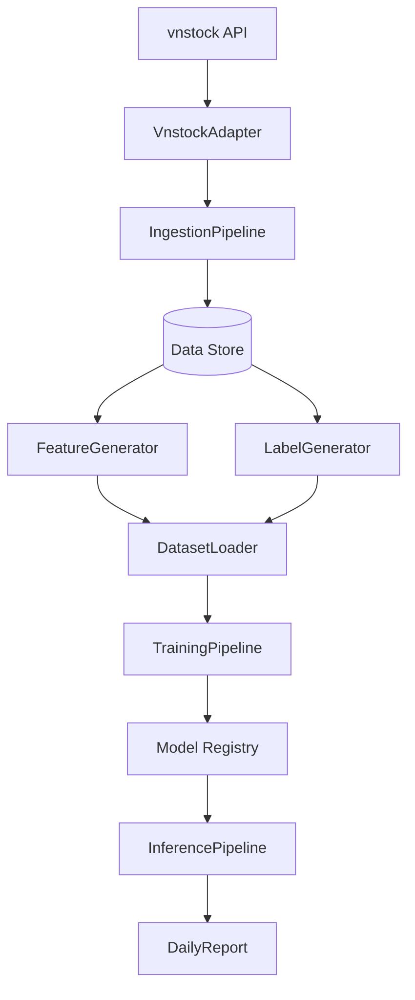

# VN100 Stock Prediction Architecture Map

This document describes the flow of data and logic in the VN100 stock prediction system.

## System Components

### 1. Data Ingestion layer
- **Adapters**: `src/adapters/vnstock_adapter.py`. Interactions with `vnstock` (Silver Plan).
- **Ingestion Pipeline**: `src/pipelines/data_ingestion.py`. Daily sync of OHLC and fundamentals.

### 2. Research & Engineering layer
- **Features**: `src/features/`. Technical indicators and fundamental ratios.
- **Labels**: `src/labels/`. Regression and classification targets.
- **Datasets**: `src/datasets/`. Data splits, temporal alignment, and loading.

### 3. Training layer
- **Training**: `src/training/`. Baseline models (CatBoost, LightGBM).
- **Training Pipeline**: `src/pipelines/training_pipeline.py`. Orchestrates training jobs.

### 4. Inference & Reporting layer
- **Inference**: `src/inference/`. Prediction engine.
- **Inference Pipeline**: `src/pipelines/inference_pipeline.py`. Batch predictions.
- **Reports**: `src/reports/`. Daily prediction summary.

### 5. Quality & Validation
- **Validators**: `src/validators/`. Data integrity and schema checks.

## Data Flow

