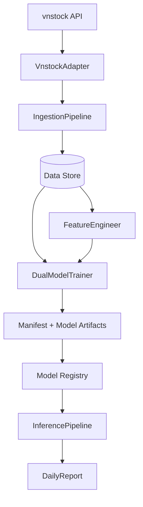

# VN100 Stock Prediction Architecture Map

This document describes the flow of data and logic in the VN100 stock prediction system.

## System Components

### 1. Data Ingestion layer
- **Adapters**: `src/adapters/vnstock_adapter.py`. Interactions with `vnstock` (Silver Plan).
- **Ingestion Pipeline**: `src/pipelines/data_ingestion.py`. Daily sync of OHLC and fundamentals.

### 2. Research & Engineering layer
- **Features**: `src/ml/feature_engineering.py`. Canonical daily feature generation for the active ML path.
- **Labels**: `src/ml/trainer.py`. Forward-return, direction, and profit-after-cost targets are generated inside the modern trainer path.
- **Legacy dataset skeleton**: `src/data/datasets/loader.py`. Historical scaffold only, not a supported training entrypoint.

### 3. Training layer
- **Supported training**: `src/ml/trainer.py`. `DualModelTrainer.train(...)` and `train_explicit_split(...)` are the active training interfaces.
- **Legacy baseline stack**: `src/ml/pipelines/training_pipeline.py` and `src/ml/training/baseline_model.py`. Retained only for reference and intentionally blocked at runtime.

### 4. Inference & Reporting layer
- **Inference**: `src/ml/inference/`. Manifest-driven prediction engine.
- **Inference Pipeline**: `src/ml/pipelines/inference_pipeline.py`. Batch predictions and report orchestration.
- **Reports**: `src/reporting/reports/`. Daily prediction summaries with explicit heuristic-risk semantics.

### 5. Quality & Validation
- **Validators**: `src/validators/`. Data integrity and schema checks.

## Data Flow

