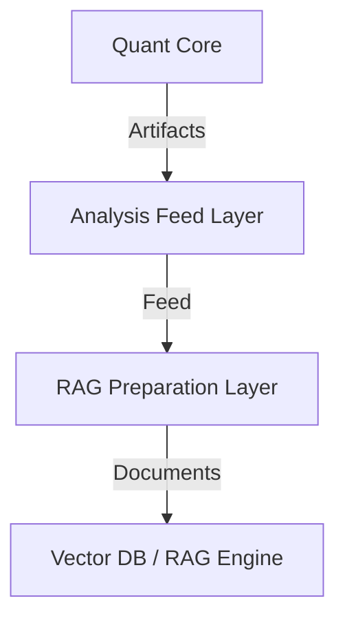

# RAG Preparation Layer
## Document Metadata

| Field | Value |
| --- | --- |
| Document type | Retrieval archive |
| Created / authored | Monday, 2026-04-20 00:28:39 ICT (UTC+07:00) |
| Last updated | Tuesday, 2026-04-28 22:51:14 ICT (UTC+07:00) |
| Timezone | Asia/Ho_Chi_Minh / ICT (UTC+07:00) |
| Branch | `vsef-doc-datetime-metadata-standardization` |
| Commit | `ef20ce73b466d75a61ca4768d4f4129405df7fb0` |
| Timestamp source | Git history |
| Status | Archived |

The **RAG Preparation Layer** is the final data normalization stage before ingestion into vector databases or RAG frameworks. It sits on top of the **Analysis Feed Layer**.

## Positioning



## Retrieval Pipeline

1.  **Selection**: Classifies feed artifacts into primary and secondary retrieval sources.
2.  **Rendering**: Deteministically turns structured data into narrativized synopses for embedding.
3.  **Metadata Extraction**: Extracts canonical filter fields (ticker, regime, etc.) for hybrid search.
4.  **Provenance**: Preserves the full chain from Quant Core commit to retrieval document.

## Canonical Sources

| Source | Role | Description |
| :--- | :--- | :--- |
| **Historical Cases** | Primary | Narrative research cases. Best for broad semantic lookup. |
| **Research Packets** | Secondary | Technical quant data. Best for deep evidence retrieval. |

## Implementation Details

- **Schema**: [src/core/retrieval_schema.py](../../../src/core/retrieval_schema.py)
- **Indexing Strategy**: [RETRIEVAL_INDEXING_STRATEGY.md](2026-04-20_Monday__RETRIEVAL_INDEXING_STRATEGY.md)
- **Runner**: [scripts/run_retrieval_prep.py](../../../scripts/run_retrieval_prep.py)

## Execution

```bash
python scripts/run_retrieval_prep.py \
  --mode build_from_existing_analysis_feed \
  --analysis-feed-dir artifacts/analysis_feed \
  --output-dir artifacts/retrieval_prep
```
