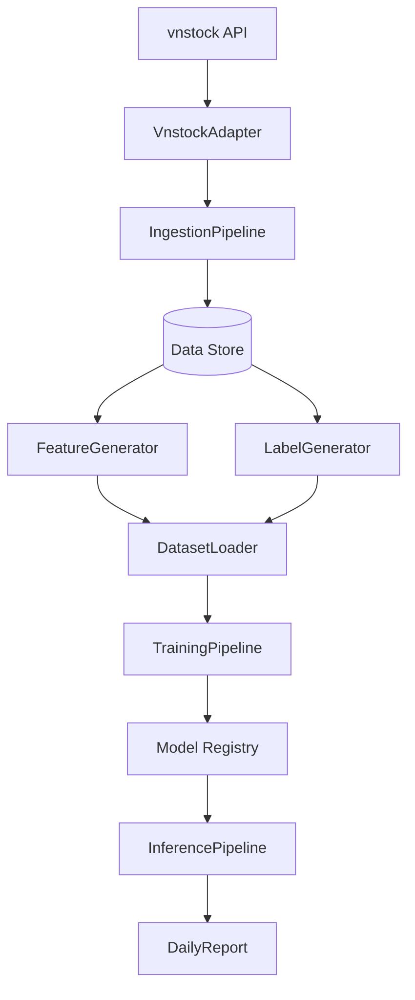

# VN100 Stock Prediction System Skeleton

I have established a modular, scalable architecture for the VN100 stock prediction system. This skeleton provides the foundation for data ingestion, feature engineering, model training, and automated reporting without breaking any existing functionality.

## Changes Made

### 1. New Modular Package Structure
- `src/adapters/`: Standardized interface for `vnstock`.
- `src/features/`: Separate modules for technical and fundamental indicators.
- `src/labels/`: Label engineering for regression and classification tasks.
- `src/datasets/`: Data loading and temporal splitting logic.
- `src/training/`: Baseline model implementation.
- `src/pipelines/`: Orchestration for ingestion, training, and inference.
- `src/inference/`: Prediction engine.
- `src/validators/`: Data quality and schema verification.
- `src/reports/`: Daily summary report generation.

### 2. Documentation
- Created [architecture_map.md](file:///h:/AI-ML-LLM%20in%20Stock_march26_PTIT_NEU/docs/architecture_map.md) detailing the system flow and components.

### 3. Verification & Testing
- Added smoke tests in `tests/test_vn100_adapters.py` and `tests/test_vn100_features.py`.
- Verified that all new modules are importable and follow the project's coding style (type hints, logging, docstrings).

## System Flow



## How to Run Smoke Tests
To verify the skeleton, you can run:
```powershell
python -m pytest tests/test_vn100_adapters.py tests/test_vn100_features.py
```
