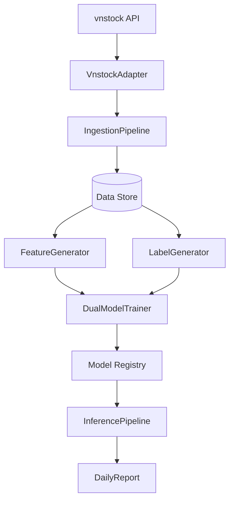

# VN100 Stock Prediction System Skeleton

This document describes an older scaffold. The supported ML path now runs through `src/ml/trainer.py` and the real backtest scripts, not the legacy `TrainingPipeline`.

## Changes Made

### 1. New Modular Package Structure
- `src/adapters/`: Standardized interface for `vnstock`.
- `src/features/`: Separate modules for technical and fundamental indicators.
- `src/labels/`: Label engineering for regression and classification tasks.
- `src/data/datasets/`: Legacy dataset loading scaffold retained for reference only.
- `src/ml/training/`: Legacy baseline scaffold retained for reference only.
- `src/ml/trainer.py`: Supported manifest-driven trainer and inference path.
- `src/ml/inference/`: Prediction engine.
- `src/validators/`: Data quality and schema verification.
- `src/reporting/reports/`: Daily summary report generation.

### 2. Documentation
- See [architecture_map.md](architecture_map.md) for the current system flow and canonical ML path.

### 3. Verification & Testing
- Added smoke tests in `tests/test_vn100_adapters.py` and `tests/test_vn100_features.py`.
- Verified that all new modules are importable and follow the project's coding style (type hints, logging, docstrings).

## System Flow



## How to Run Smoke Tests
To verify the skeleton, you can run:
```powershell
python -m pytest tests/test_vn100_adapters.py tests/test_vn100_features.py
```
